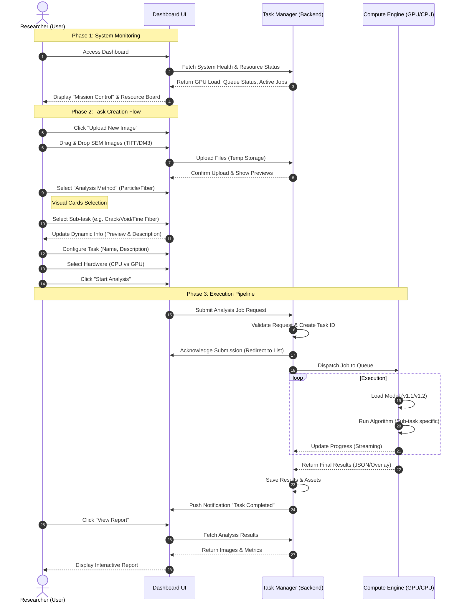

# UniAIMS 2.0 System Swimlane Diagram

This document illustrates the efficient interaction flow between the User, the Dashboard UI, the Task Management System, and the Compute Resources (GPU/CPU) within UniAIMS 2.0.

## Diagram Legend

*   **Researcher (User)**: The scientific user interacting with the platform.
*   **Dashboard UI**: The React-based frontend (UploadView, DashboardView).
*   **Task Manager**: The backend system handling file management, job orchestration, and database state.
*   **Compute Engine**: The hardware resources (GPUs/CPUs) executing the actual computer vision models.
